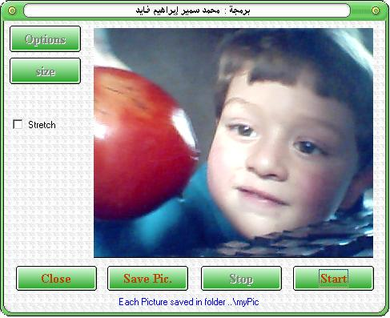



## VB WebCam Capture

### Description

Capture WebCam Picture and Save it in JPEG format

This Code is a collection of some code from this site from vb, c#

and connverted to be core VB6 code .

most code is commented in English .

I love vb ....

I love this site .....

so this code for you and for this site
 
### More Info
 

             |
---                |---
**Submitted On**   |2004-11-05 00:17:48
**By**             |[Mohammed Fayed](https://github.com/Planet-Source-Code/PSCIndex/blob/master/ByAuthor/mohammed-fayed.md)
**Level**          |Advanced
**User Rating**    |4.9 (34 globes from 7 users)
**Compatibility**  |VB 5\.0, VB 6\.0
**Category**       |[Complete Applications](https://github.com/Planet-Source-Code/PSCIndex/blob/master/ByCategory/complete-applications__1-27.md)
**World**          |[Visual Basic](https://github.com/Planet-Source-Code/PSCIndex/blob/master/ByWorld/visual-basic.md)
**Archive File**   |[VB\_WebCam\_1855842212005\.zip](https://github.com/Planet-Source-Code/mohammed-fayed-vb-webcam-capture__1-59068/archive/master.zip)

